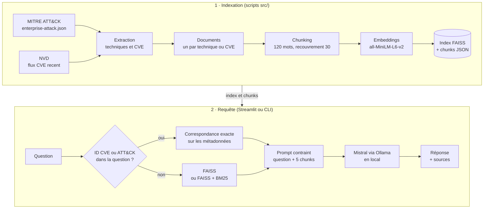

# rag-cyber-mitre-nvd

Assistant de questions-réponses pour l'analyse de menaces : on l'interroge en langage naturel sur une technique MITRE ATT&CK ou une CVE, il répond en français à partir des sources officielles, extraits à l'appui, avec un LLM exécuté en local.
Sur 20 questions d'évaluation, le RAG retrouve 18 des 24 informations absentes de la question (nom, produit, sévérité, CWE…) ; Mistral seul n'en retrouve aucune.

## Le problème

Face à un identifiant dans une alerte ou un bulletin (`CVE-2025-14037`, `T1053.005`), il faut ouvrir la fiche NVD ou la page ATT&CK pour retrouver la sévérité, la faiblesse (CWE), le produit concerné ou les pistes de détection. Un LLM généraliste répond plus vite, mais il ne connaît pas les CVE publiées après son entraînement et invente les détails. Ce projet interroge un corpus local construit à partir de MITRE ATT&CK et du flux NVD, actualisable en relançant les scripts de téléchargement, et montre les extraits utilisés pour chaque réponse.

## 🧱 Architecture



| Étape | Script | Détail |
|---|---|---|
| 1. Récupération | `download_mitre.py`, `download_nvd_recent.py` | Bundle STIX `enterprise-attack.json` du dépôt `mitre/cti` et flux `nvdcve-2.0-recent.json.gz` du NVD |
| 2. Extraction | `extract_mitre_techniques.py`, `extract_nvd_recent.py` | Techniques non révoquées et non dépréciées (ID, nom, plateformes, sources de données, détection) ; CVE avec description, score et sévérité CVSS (v4.0, sinon v3.1, v3.0, v2) et CWE |
| 3. Documents | `build_rag_documents.py` | Un document texte par technique ou CVE, avec ses métadonnées (`attack_id`, `cve_id`, sévérité, score) |
| 4. Chunking | `chunk_rag_documents.py` | Fenêtres de 120 mots avec 30 mots de recouvrement |
| 5. Embeddings | `build_faiss_full.py` | `sentence-transformers/all-MiniLM-L6-v2`, vecteurs de 384 dimensions |
| 6. Index | `build_faiss_full.py` | FAISS `IndexFlatL2` (recherche exacte par distance L2), chunks et métadonnées enregistrés en JSON |
| 7. Récupération | `app*.py`, `mini_rag_*.py` | Si la question contient un identifiant (`CVE-AAAA-NNNN`, `T1053`, `T1053.005`), correspondance exacte sur les métadonnées ; sinon recherche FAISS ou hybride |
| 8. Génération | `app*.py`, `mini_rag_*.py` | Prompt contraint (répondre uniquement à partir du contexte, signaler un contexte insuffisant, citer les ID, répondre en français), envoyé à Mistral via l'API locale d'Ollama |

Corpus au moment de l'évaluation : 691 techniques, 1 948 CVE, soit 2 639 documents et 3 926 chunks.

## Stack technique

- **Python 3.11** (version testée)
- **FAISS** (`faiss-cpu`) : index vectoriel
- **sentence-transformers** : embeddings `all-MiniLM-L6-v2`
- **rank-bm25** : recherche lexicale de la variante hybride
- **Ollama + Mistral** : génération en local, sans API externe ni clé
- **Streamlit** : interfaces web
- `numpy`, `requests`, `python-dotenv`
- Données : MITRE ATT&CK Enterprise (STIX 2.1), NVD CVE JSON 2.0

## Fonctionnalités

### Variantes de RAG

| Variante | Recherche | Point d'entrée |
|---|---|---|
| Small | FAISS seul, index de test de 100 chunks, top 3 | `src/mini_rag_small.py` |
| Full | FAISS seul, corpus complet, top 5 | `src/mini_rag_full.py` |
| Full v2 | Correspondance exacte sur l'ID, sinon FAISS | `src/mini_rag_full_v2.py`, `app.py` |
| Hybride | Correspondance exacte sur l'ID, sinon FAISS + BM25 | `src/mini_rag_hybrid.py`, `app_hybrid.py` |

Recherche hybride : 10 candidats FAISS (score `1 / (1 + distance)`) et 10 candidats BM25 (score divisé par le meilleur score BM25), fusionnés par `0,6 × vecteur + 0,4 × BM25`. Les 5 meilleurs chunks forment le contexte.

### Interfaces Streamlit

`app.py` (exact-match + FAISS) et `app_hybrid.py` (exact-match + BM25 + FAISS) affichent :
- la réponse de Mistral ;
- le mode de recherche utilisé (`exact`, `faiss` ou `hybrid`) ;
- chaque source dans un encart dépliable : identifiant du chunk, document parent, extrait, et distance FAISS (`app.py`) ou scores hybride, vectoriel et BM25 (`app_hybrid.py`).

### 📊 Évaluation : RAG vs LLM seul

Une chaîne d'évaluation compare, sur les mêmes 20 questions (10 ATT&CK, 10 CVE), les réponses du RAG et celles de Mistral sans contexte.

| Fichier | Rôle | Sortie |
|---|---|---|
| `data/eval/questions.json` | Questions et éléments attendus (ID, nom, produit, sévérité, CWE) | |
| `src/evaluate_rag.py` | Pipeline exact-match + FAISS + Mistral ; enregistre réponse, mode de recherche et sources | `rag_results.json` |
| `src/evaluate_llm_only.py` | Mêmes questions posées à Mistral sans contexte | `llm_only_results.json` |
| `src/compare_results.py` | Score par question, gagnant, moyennes globales et par catégorie | `comparison_results.json`, `comparison_summary.txt` |

Le score de couverture est la part des éléments attendus retrouvés dans la réponse (comparaison de sous-chaînes, sans tenir compte de la casse).

| Couverture moyenne | RAG | LLM seul |
|---|---|---|
| Global | **0,85** | 0,40 |
| MITRE ATT&CK | **0,80** | 0,55 |
| CVE | **0,90** | 0,25 |

Le RAG est meilleur sur 15 questions, à égalité sur 5, jamais moins bon.

Décomposition calculée à partir de `rag_results.json` et `llm_only_results.json` :

| Éléments attendus retrouvés | RAG | LLM seul |
|---|---|---|
| Déjà présents dans le texte de la question (16) | 16 | 16 |
| Absents de la question : ID, nom, produit, sévérité, CWE (24) | **18** | **0** |

Limites de la mesure :
- la comparaison de sous-chaînes est indulgente : pour `T1053.002`, l'élément attendu « At » est trouvé dans n'importe quel mot contenant « at » (« ATT&CK », « catalogue ») ;
- 19 questions sur 20 contiennent un identifiant et passent par la correspondance exacte ; la variante hybride n'est pas évaluée ;
- une seule exécution, sans température fixée : les réponses de Mistral peuvent varier d'un passage à l'autre.

## Installation et lancement

### Prérequis

- Python 3.11
- [Ollama](https://ollama.com) installé, avec le modèle Mistral (environ 4 Go) :

  ```bash
  ollama pull mistral
  ```

- **Ollama doit tourner en local** pendant l'utilisation. L'application de bureau démarre le serveur ; sinon, lancer `ollama serve`. Les scripts l'appellent sur `http://127.0.0.1:11434`.
- Une connexion Internet au premier lancement, pour télécharger le modèle d'embeddings depuis Hugging Face (et les données en option B).

### 1. Installer

```bash
git clone https://github.com/MjBilaal/rag-cyber-mitre-nvd.git
cd rag-cyber-mitre-nvd
python -m venv .venv
source .venv/bin/activate          # Windows : .venv\Scripts\activate
pip install -r requirements.txt
cp .env.example .env               # Windows : copy .env.example .env
```

Toutes les commandes suivantes se lancent depuis la racine du dépôt.

### 2. Construire l'index

**Option A : échantillon fourni** (50 techniques et 50 CVE, dont celles des questions d'évaluation). Dans `.env`, remplacer `DATA_PROCESSED=data/processed` par `DATA_PROCESSED=data/sample`, puis :

```bash
python src/build_rag_documents.py
python src/chunk_rag_documents.py
python src/build_faiss_full.py
```

**Option B : corpus complet**, avec `DATA_PROCESSED=data/processed` :

```bash
python src/download_mitre.py
python src/download_nvd_recent.py
python src/extract_mitre_techniques.py
python src/extract_nvd_recent.py
python src/build_rag_documents.py
python src/chunk_rag_documents.py
python src/build_faiss_full.py
```

Le flux NVD « recent » évolue en continu : un nouveau téléchargement ne contiendra plus forcément les CVE des questions d'évaluation.

### 3. Lancer

```bash
streamlit run app_hybrid.py
```

L'interface s'ouvre sur `http://localhost:8501`. `streamlit run app.py` lance la version sans BM25.

En ligne de commande, `python src/mini_rag_hybrid.py` demande la question dans le terminal. `src/mini_rag_small.py` nécessite d'abord `python src/build_faiss_small.py`.

### 4. Rejouer l'évaluation

```bash
python src/evaluate_rag.py
python src/evaluate_llm_only.py
python src/compare_results.py
```

Ces scripts réécrivent les fichiers de résultats de `data/eval/`. Les scores ci-dessus ont été obtenus sur le corpus complet.

À noter :
- `app.py`, `app_hybrid.py` et `evaluate_rag.py` lisent l'index dans `vectorstore/faiss_index/` (chemin fixe) : garder la valeur par défaut de `FAISS_DIR` ;
- le modèle (`OLLAMA_MODEL = "mistral"`) et le nombre de chunks retenus (`TOP_K`) sont des constantes en tête de chaque script.

## 💡 Ce que j'ai appris

- **Le score du LLM seul est un écho de la question** : ses 0,40 viennent uniquement d'éléments déjà écrits dans la question. Pour le reste, il se trompe avec assurance (`T1086` pour « Scheduled Task », « CVSS 9,8, RCE » pour une XSS notée MEDIUM 6,4).
- **Les erreurs restantes du RAG viennent de la génération, pas de la recherche** : pour les 6 réponses incomplètes, l'élément attendu figurait dans le contexte transmis. La consigne « répondre en français » pousse Mistral à traduire les noms officiels (« Filtres de socket ») et à paraphraser les CWE ; il faudrait imposer de citer noms et identifiants tels quels.
- **Les embeddings ignorent les identifiants** : avec MiniLM, « What is CVE-2025-14037? » et « What is CVE-2025-14038? » ont une similarité cosinus de 0,976. D'où la correspondance exacte sur les ID, complétée par BM25 dans la variante hybride.

---

MITRE ATT&CK® est une marque déposée de The MITRE Corporation ; les données sont reproduites selon ses [conditions d'utilisation](https://attack.mitre.org/resources/legal-and-branding/terms-of-use/). Les données CVE proviennent de la National Vulnerability Database (NIST).
